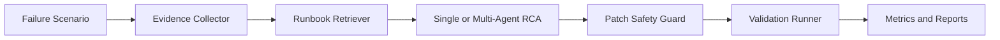

# AegisOps Agent

AegisOps Agent is an agentic DevOps RCA and remediation portfolio project for CI/CD, Docker, Kubernetes, security, and latency incidents.

It is designed as a portfolio project for ESIPS-style AI/software placements, especially Accenture's SDLC agent and Kubernetes DevOps briefs. The project shows how an LLM-style agent can enter a real engineering workflow without becoming an unverified chatbot: it collects evidence, retrieves runbook context, diagnoses a root cause, generates a safe patch preview, runs validation, and reports quality, cost, latency, and tool-call metrics.

It uses deterministic fixtures and a `MockLLM`, so the main demo runs locally without API keys:

```bash
make setup
make quickstart
make acceptance
make test
make build-index
make eval-mock
make matrix
make doctor
make demo SCENARIO=S4 MODE=multi
make report
```

## Portfolio Pitch

> AegisOps Agent demonstrates an AI-assisted engineering workflow for operational failures. Given a reproducible CI/CD, Docker, Kubernetes, security, or latency incident, it gathers evidence, retrieves relevant runbooks, runs either a single-agent or multi-agent RCA workflow, produces a guarded patch preview, validates the fix, and exports an auditable report.

This positioning is intentionally broader than a RAG chatbot. The model is only one component inside a controlled software-delivery loop with tests, safety constraints, and measurable trade-offs.

## Open-Source Context And Boundary

AegisOps sits in the same broad agentic software-engineering ecosystem as projects such as [SWE-agent](https://github.com/SWE-agent/SWE-agent), [mini-swe-agent](https://github.com/SWE-agent/mini-swe-agent), [OpenHands](https://github.com/OpenHands/OpenHands), and [LangGraph](https://github.com/langchain-ai/langgraph). The shared theme is using an agent workflow to move from engineering evidence to a proposed software action.

The boundary is deliberate: this project is a deterministic portfolio demo, not a full autonomous developer platform. It uses local scenarios, synthetic incidents, a `MockLLM`, whitelisted patch previews, and repeatable validation so the workflow can be inspected in an ESIPS interview without credentials, hidden services, or uncontrolled production actions.

## Why This Matters For Accenture ESIPS

| Accenture theme | AegisOps evidence |
| --- | --- |
| SDLC agent automation | Incident -> diagnosis -> patch preview -> validation -> report |
| Kubernetes DevOps | CrashLoopBackOff, readiness probe, image tag, and deployment scenarios |
| Agent memory / RAG | Markdown runbook retrieval and reusable incident context |
| Sustainable GenAI | Deterministic token, cost, latency, and ROI proxy metrics |
| Single vs multi-agent | `MODE=single` and `MODE=multi` use the same scenarios for comparison |
| Cloud security / IT operations | Container security and DevOps dry-run validation scenarios |

## What It Does



The MVP includes:

- FastAPI-compatible demo service with `/health`, `/predict`, `/orders/{id}`, and `/metrics`
- 8 reproducible failure scenarios
- Evidence JSON generation
- Markdown runbook retrieval
- Deterministic MockLLM diagnosis
- Single-agent and multi-agent orchestration
- Whitelisted patch preview generation
- pytest, compile-lint, and DevOps dry-run validation
- Evaluation reports for accuracy, fix success, latency, cost, and tool calls
- Scenario matrix and environment doctor reports for portfolio review

## Current Results

The latest local validation covers 8 scenarios in both single-agent and multi-agent modes:

| metric | current result |
| --- | ---: |
| diagnosis accuracy | 1.00 |
| fix success rate | 1.00 |
| evaluated runs | 16 |
| reproducible failure scenarios | 8 |

The project also produces a deterministic ROI proxy so the discussion can move beyond "AI is cool" into engineering value, review cost, and operational risk.

## Newcomer Guide

If this is your first time opening the project, start here:

[docs/NEWCOMER_GUIDE.zh-CN.md](docs/NEWCOMER_GUIDE.zh-CN.md)

For mentor, ESIPS, or interview scoring, use the SOW evidence packet:

- [SOW.md](SOW.md) - one-page scoring contract with scope, milestones, acceptance criteria, weights, and rubric.
- [POC_VALIDATION.md](POC_VALIDATION.md) - PoC validation loop for functional, performance, quality, and cost/ops scoring.
- [DATACARD.md](DATACARD.md) - synthetic data provenance, field dictionary, compliance boundary, and limitations.
- [OPERATIONS.md](OPERATIONS.md) - setup, demo, CI/CD, Kubernetes, troubleshooting, and release runbook.
- [reports/acceptance-checklist.md](reports/acceptance-checklist.md) - machine-refreshable readiness checklist.

Recommended first command:

```bash
make quickstart
```

Before treating the project as portfolio-ready, run:

```bash
make acceptance
```

## PoC Scorecard

Run the full PoC validation loop:

```bash
make poc RUNS=3
```

Read:

```text
reports/scorecard.txt
reports/poc-metrics.json
reports/reproducibility_report.json
```

The scorecard uses explicit thresholds and weights from `config/poc-scorecard.json`.

## One-Command Demo

```bash
make demo SCENARIO=S4 MODE=multi
```

Expected outputs:

```text
reports/S4/evidence.json
reports/S4/multi/diagnosis.json
reports/S4/multi/patch.diff
reports/S4/multi/validation.log
reports/S4/multi/metrics.json
reports/S4/multi/demo-report.md
reports/S4/multi/pr-summary.md
reports/S4/multi/issue-to-pr-report.md
```

For S4, the expected root cause is:

```text
invalid_app_mode_env
```

The fastest interview path is:

1. Run `make demo SCENARIO=S4 MODE=multi`.
2. Open `reports/S4/multi/demo-report.md`.
3. Open `reports/S4/multi/pr-summary.md` to show how the agent turns the fix into a human-reviewable PR note.
4. Show the patch preview and validation log.
5. Run `make eval-mock` or open `reports/eval-summary.md` to compare single-agent and multi-agent workflows.

For the step-by-step reviewer version, read [docs/incident-to-pr-walkthrough.md](docs/incident-to-pr-walkthrough.md).

To refresh the issue-style evidence path:

```bash
make issue-to-pr-report
```

## Useful Commands

```bash
make help
make test
make test-app
make lint
make quickstart
make acceptance
make scenario SCENARIO=S1
make collect-evidence SCENARIO=S1
make build-index
make retrieve QUERY="CrashLoopBackOff invalid environment variable"
make validate SCENARIO=S1 MODE=single
make eval-mock
make scorecard
make poc RUNS=3
make matrix
make doctor
make docker-build
make kind-setup
make report
```

## Safety Guardrails

The agent refuses patches that target:

- `.github/workflows/*`
- `agent/evaluation/gold_labels.json`
- `apps/demo-api/tests/*`
- `tests/*`

Every patch preview is checked against each scenario's `allowed_files` before validation.

## Portfolio Review Artifacts

```bash
make matrix
make doctor
make eval-mock
make report
```

These commands refresh:

```text
reports/scenario-matrix.md
reports/doctor.json
reports/doctor.md
reports/acceptance-checklist.md
reports/eval-summary.md
reports/final-portfolio-report.md
reports/S4/multi/pr-summary.md
```

## Interview Materials

- SOW contract: `SOW.md`
- PoC validation guide: `POC_VALIDATION.md`
- PoC scorecard: `reports/scorecard.txt`
- Data Card: `DATACARD.md`
- Operations manual: `OPERATIONS.md`
- ESIPS mapping: `docs/esips-accenture-mapping.md`
- Incident-to-PR walkthrough: `docs/incident-to-pr-walkthrough.md`
- Demo script: `docs/demo-script.md`
- Application pack: `docs/application-pack.md`
- PR summary example: `reports/S4/multi/pr-summary.md`
- Issue-to-PR report: `reports/S4/multi/issue-to-pr-report.md`
- Final portfolio report: `reports/final-portfolio-report.md`
