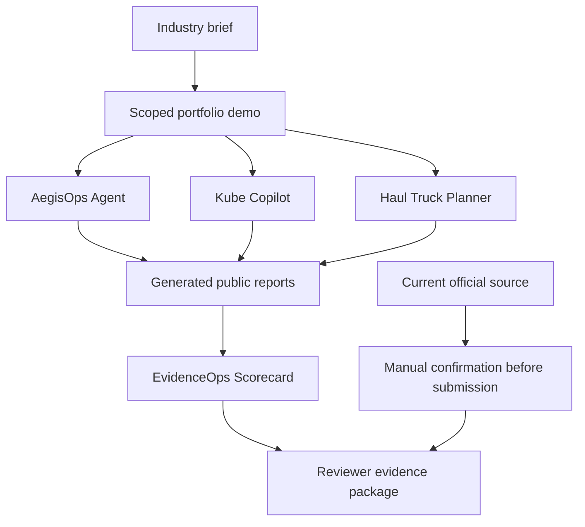
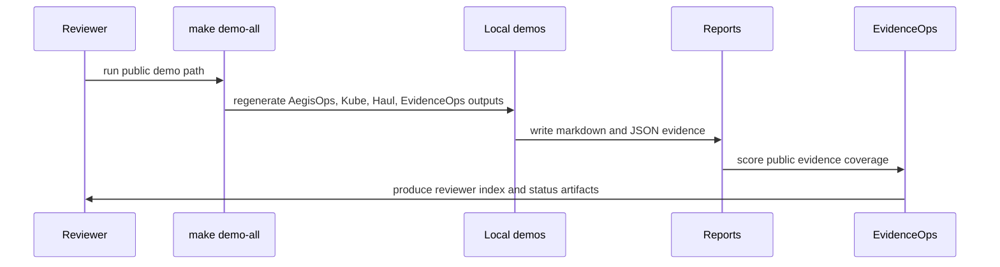

# Architecture

The repository uses one product story across four local components:

```text
industry brief -> scoped demo -> tests -> generated reports -> evidence scorecard -> reviewer package
```

## System View



## Components

| component | input | processing | output | trust boundary |
| --- | --- | --- | --- | --- |
| AegisOps Agent | synthetic incident fixture and runbook context | evidence collection, retrieval, RCA, patch preview, validation | PR-style report, diagnosis, metrics | human review before any real change |
| Kube Copilot | structured app requirements and manifest fixtures | deterministic policy checks for image tags, resources, probes, and security context | risk comparison and policy matrix | validation and review before deployment |
| Haul Truck Planner | small mine-map graph with battery, grade, charging, and risk attributes | shortest path, battery-state Dijkstra, and A* comparison | route experiment and algorithm comparison | simplified planning evidence only |
| EvidenceOps Scorecard | public reports and claim files | evidence inventory, quality scoring, PASS/WEAK/MISSING labels | evidence scorecard and submission-readiness report | public evidence check only |
| Reviewer package | generated reports and summary docs | claim tracing and guided reading order | fast-path docs and demo index | does not replace current official checks |

## Data Flow



## Why This Architecture Works

- It keeps the strongest project, AegisOps Agent, as the main SDLC evidence.
- It uses Kube Copilot and Haul Truck Planner as supporting engineering proof, not disconnected side projects.
- It separates evidence generation from application submission, so public artifacts stay reviewable and bounded.
- It makes the reviewer path command-driven: `make demo-all`, then `make portfolio-check`.

