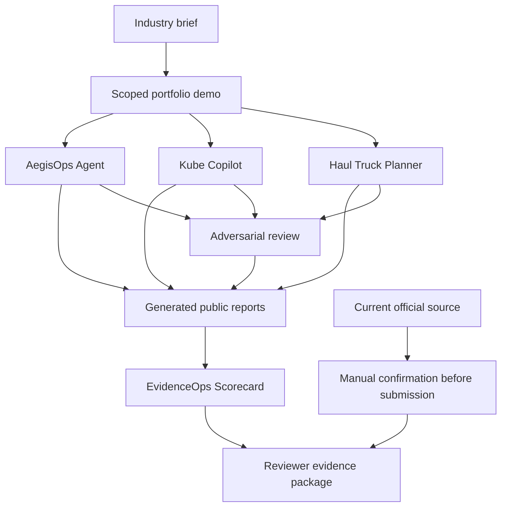
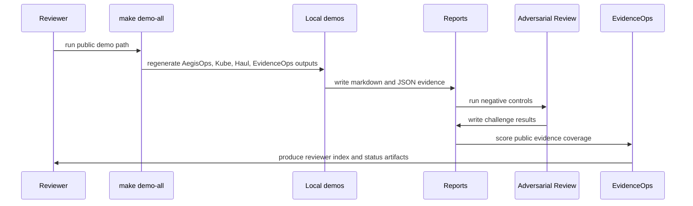

# Architecture

The repository uses one product story across four local components:

```text
industry brief -> scoped demo -> tests + negative controls -> generated reports -> evidence gate -> reviewer package
```

## System View



## Components

| component | input | processing | output | trust boundary |
| --- | --- | --- | --- | --- |
| AegisOps Agent | synthetic incident evidence and runbook context | evidence-derived RCA, abstention, guarded patch preview, validation | PR-style report, ranked diagnosis, metrics | `ESCALATE` on insufficient or conflicting evidence; human review before change |
| Kube Copilot | structured app requirements and YAML manifests | parsed multi-document, multi-container policy checks | risk, policy, and adversarial reports | focused pre-deployment checks; human review before deployment |
| Haul Truck Planner | mine grid, battery state, explicit energy model, grade, charging, and risk | validated shortest path, battery-state Dijkstra, and A* comparison | route experiment and sensitivity analysis | synthetic parameters and simplified grid planning only |
| Adversarial Review | cross-project attack fixtures | gold-label tampering, evidence conflict, YAML bypasses, invalid route states | Markdown and JSON challenge result | deterministic negative controls, not formal assurance |
| EvidenceOps Scorecard | public reports, structured outputs, and claim files | evidence completeness and structural checks, PASS/WEAK/MISSING labels | evidence scorecard and submission-readiness report | public evidence check only |
| Reviewer package | generated reports and summary docs | claim tracing and guided reading order | fast-path docs and demo index | does not replace current official checks |

## Data Flow



## Why This Architecture Works

- It keeps the strongest project, AegisOps Agent, as the main SDLC evidence.
- It uses Kube Copilot and Haul Truck Planner as supporting engineering proof, not disconnected side projects.
- It separates evidence generation from application submission, so public artifacts stay reviewable and bounded.
- It makes the reviewer path command-driven: `make demo-all`, then `make portfolio-check`.
